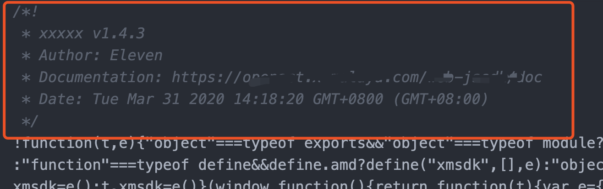

## 在打包的文件头部添加 Banner 信息

在打包文件时，某些场景可能需要在文件顶部添加描述信息，例如：版本、版权、作者、发布时间以及其它相关说明等，通常在打包 JS 库时比较常见，官方提供了 [webpack.BannerPlugin](https://webpack.js.org/plugins/banner-plugin/) 实现此功能。

```js
const webpack = require('webpack')
const { version, author, homepage } = require('../package')

...
module.exports = {
  ...
  plugins: [
    // webpack.BannerPlugin 添加在这里会无效，因为生成的注释描述会被 TerserPlugin 或其它压缩插件清掉
  ],
  optimization: {
    minimizer: [
      new TerserPlugin({
        ...
      }),
      new OptimizeCSSAssetsPlugin({
        ...
      }),
      // 注意位置，必须放在 TerserPlugin 后面，否则生成的注释描述会被 TerserPlugin 或其它压缩插件清掉
      new webpack.BannerPlugin({
        entryOnly: true, // 是否仅在入口包中输出 banner 信息
        banner: () => {
          return `xxxxx v${version}`
                + `\n`
                + `Author: ${author}`
                + `\n`
                + `Documentation: ${homepage}`
                + `\n`
                + `Date: ${new Date()}`
        }
      }),
    ]
  }
}
...
```

效果示例：

