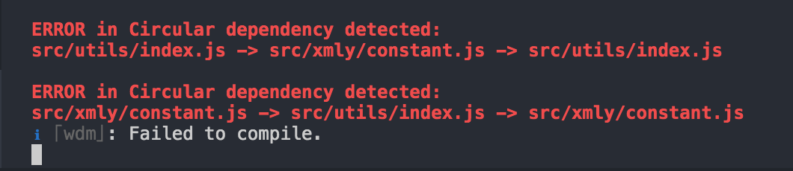

## 模块间循环引用问题

有时候可能会遇见这样的场景：模块A引用了模块B里的func1方法，而模块B又引用了模块A里的func2方法。

类似上面的场景，或者其它更复杂的如：A 引用 B，B 引用 C，C 又引用了 A，在不经意间可能会遇到一些诡异问题，如：明明代码没问题，却读不到导入的模块......

为了更好地避免这样的问题，可以使用 [circular-dependency-plugin](https://github.com/aackerman/circular-dependency-plugin) 插件来做循环引用的检测:

基本用法如下，复制、粘贴即可生效：

```js
// webpack.config.js
const CircularDependencyPlugin = require('circular-dependency-plugin')

module.exports = {
  plugins: [
    new CircularDependencyPlugin({
      // exclude detection of files based on a RegExp
      exclude: /node_modules/,
      // include specific files based on a RegExp
      include: /src/,
      // add errors to webpack instead of warnings
      failOnError: true,
      // allow import cycles that include an asyncronous import,
      // e.g. via import(/* webpackMode: "weak" */ './file.js')
      allowAsyncCycles: false,
      // set the current working directory for displaying module paths
      cwd: process.cwd(),
    })
  ]
}
```

检测到问题时，会看到如下图的编译提示：



如何解决循环引用的问题？将被循环引用到的模块提取放到另外的模块，打破这个循环即可！

#### 参考文档

1. [webpack 与循环引用](https://www.imooc.com/article/260265)
2. [JavaScript 模块的循环加载](http://www.ruanyifeng.com/blog/2015/11/circular-dependency.html)