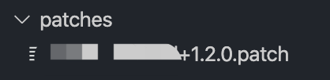

## 自动修改 node_moduels 的包源码

有时候 node_modules 中的第三方包有问题或需要修改几行源码，我们可以怎么办？

1. 去给作者提 issues？可能得不到回复。

2. 自己在 node_modules 里直接修改源码？下一次重新安装包，或者其他同事 install 的时候，被修改过的源码又恢复如初了。

3. 不用他的包，自己写一个？......

社区提供了一个工具：[patch-package](https://github.com/ds300/patch-package)，专门用来处理修改 node_modules 包源码的问题。

需要区分 npm 和 yarn，二者使用方法有一些区别，分开做描述。

#### NPM

1. 在 package.json 的 scripts 中增加如下命令：

    ```json
    "scripts": {
    +  "postinstall": "patch-package"
    }
    ```

    `postinstall` 是 npm 的钩子，会在依赖包被 `install` 之后被执行。

2. 安装 patch-package

    ```sh
    npm i patch-package -D
    ```

3. 上面两步都做了，就可以去修改 node_modules 里任意第三方包的源码了。

4. 修改了源码，随后需要执行以下命令：

    ```sh
    npx patch-package [package-name]  # [package-name] 是包名，不需要写路径。
    ```

    命令执行成功后，会发现项目根目录下多了一个文件夹 `patches`，该目录下多了文件，即为记录源码修改的文件。

    

    将 `patches` 目录及文件，通过 git 提交到代码仓库。

5. Over，后续其他同学不需要做额外操作，直接安装即可，node_modules 下的源码修改会自动更新。

    之前已经安装过该第三方包的同学，需要卸载，重新安装一次。

6. 如果后续还有其它包也需要修改源码，修改过后，再执行一次命令：

    ```sh
    npx patch-package [package-name]  # [package-name] 是包名，不需要写路径。
    ```

#### Yarn

1. 在 package.json 的 scripts 中增加如下命令：

    ```json
    "scripts": {
    +  "postinstall": "patch-package"
    }
    ```

    `postinstall` 是 npm 的钩子，会在依赖包被 `install` 之后被执行。

2. 安装 patch-package、postinstall-postinstall

    ```sh
    yarn add patch-package postinstall-postinstall -D
    ```

3. 上面两步都做了，就可以去修改 node_modules 里任意第三方包的源码了。

4. 修改了源码，随后需要执行以下命令：

    ```sh
    yarn patch-package [package-name]  # [package-name] 是包名，不需要写路径。
    ```

    命令执行成功后，会发现项目根目录下多了一个文件夹 `patches`，该目录下多了文件，即为记录源码修改的文件。

    

    将 `patches` 目录及文件，通过 git 提交到代码仓库。

5. Over，后续其他同学不需要做额外操作，直接安装即可，node_modules 下的源码修改会自动更新。

    之前已经安装过该第三方包的同学，需要卸载，重新安装一次。

6. 如果后续还有其它包也需要修改源码，修改过后，再执行一次命令：

    ```sh
    yarn patch-package [package-name]  # [package-name] 是包名，不需要写路径。
    ```


## 其它

1. 过程中遇到一个错误，记录一下，其他人不一定会遇到。

    macos 在终端报如下错误:

    

    可以参照这个文档解决：https://www.cnblogs.com/start-fxw/p/10192226.html

    终端运行如下命令：

    ```sh
    xcode-select --install
    ```

    更新一下 xcode 即可。